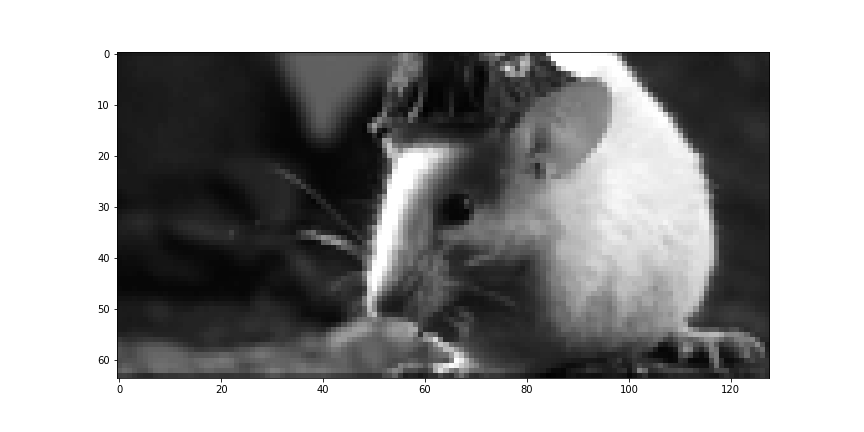
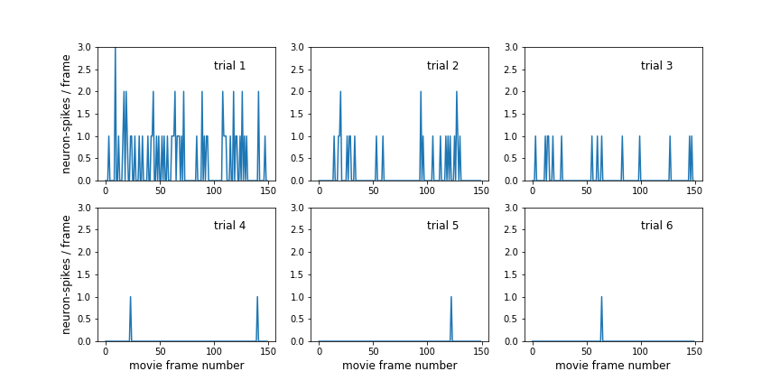
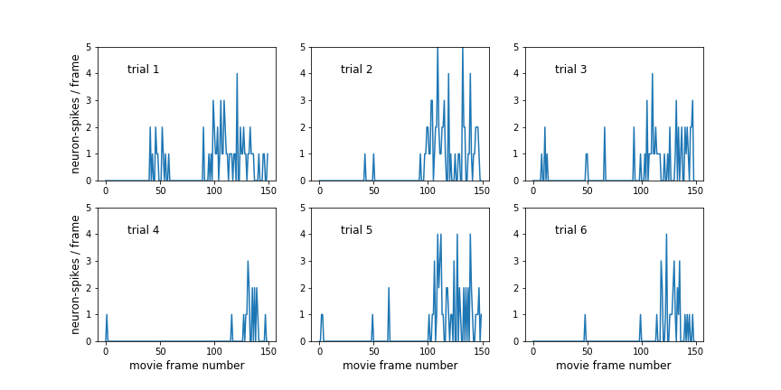

# SCML Fall 2017 Competition 
Check the original README for details of the competition and fun info about the superior colliculus: https://github.com/santacruzml/fall-17-scml-competition

The goal is to model neuron firing in the superior colliculus (SC) of a mouse, while said mouse with a sensor in its brain watches a WWII themed movie of mice wearing funny hats. This is either super cute or totally morbid...

## Recap
My original entry for this competition received the "Endeavor Prize", which was a nice gesture recognizing that I tired the most number of approaches on a somewhat intractable problem. The winning entry basically guessed the mean output of each neuron, which is always a good answer, especially when things get noisy, but correlations in time were low (<r^2> = 0.02).  Why is this problem such a doozy? Let's check out the data:

Here's a movie frame grab:

See! Cute mice in hats! What could go wrong...  well, some of the movie contains no data whatsoever, just a black screen, which would be fine if the SC stopped firing or assumed a constant state, but the mouse (just like you) keeps searching for something in its visual field and the neurons keep firing.

Ok, let's checkout the output (neuron) data. Each movie clip is repeated six times, and if we're going to make sense of the output let's hope there's a pattern.  Here's the output of neuron #1 for six repeated trials:

Do you see a pattern? I don't. Is the mouse getting bored?

How about another neuron? Here's neuron #32:

If you squint you might see a pattern here, with a higher firing rate at the end of the clip. All is not lost, but this is some super noisy data. 

